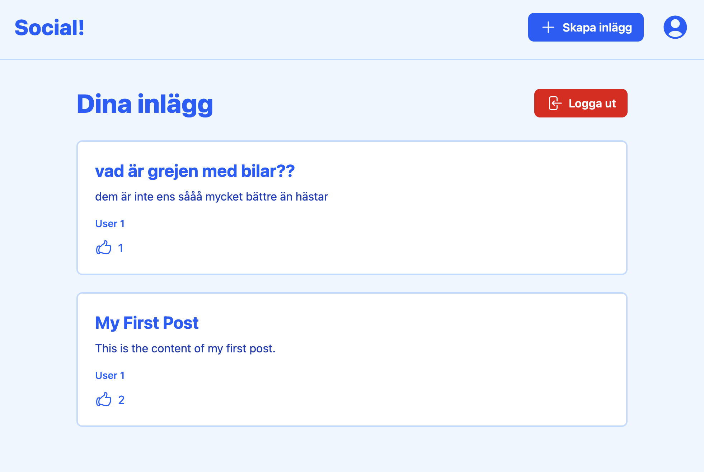

# Social!

På social! kan användare registrera sig, logga in, skapa inlägg och gilla andra användares inlägg. Projektet är byggt med **React** och **Tailwind** för frontend och **Express** för backend, med **SQLite** som databas.



## Funktioner

-   **Registrering och inloggning**: Användare kan skapa ett konto och logga in.
-   **Skapa inlägg**: Inloggade användare kan skapa och publicera inlägg.
-   **Gilla inlägg**: Användare kan gilla andras inlägg.
-   **Säker backend**: Hanteringen av lösenord är gjord med säkerhet.

## Stack

-   **Frontend**: React (med Vite), Tailwind CSS
-   **Backend**: Express.js
-   **Databas**: SQLite

## Installation

Följ dessa steg för att sätta upp projektet lokalt:

1. **Klona repot**:

    ```bash
    git clone https://github.com/edwjoh/social.git
    cd social
    ```

2. **Installera beroenden för både frontend och backend**:

    ```bash
    cd frontend
    npm install
    cd ../backend
    npm install
    ```

3. **Starta backend-servern**:

    ```bash
    cd src
    node server.js
    ```

    Servern kommer att starta på `http://localhost:3000`.

4. **Starta frontend-utvecklingsservern**:

    ```bash
    cd ../../frontend
    npm run dev
    ```

    Frontend-servern kommer att starta på `http://localhost:5173`.

5. **Öppna appen**:
   Öppna din webbläsare och gå till `http://localhost:5173` för att testa appen.

## Licens

Detta projekt är licensierat under MIT-licensen - se filen [LICENSE](LICENSE) för detaljer.

## Kontakt

Om du har frågor eller feedback, kontakta mig gärna via [email](mailto:edwa.joha@gmail.com).
